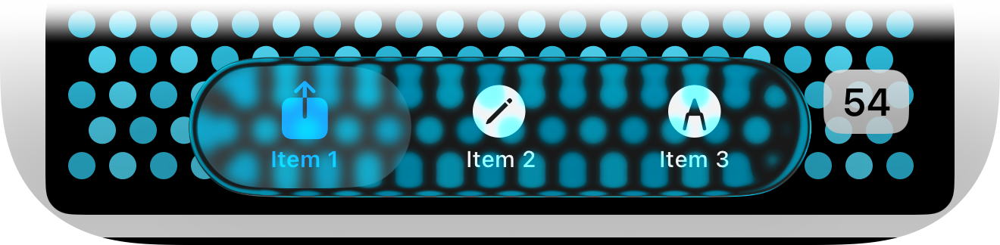

# LiquidGlassDemo

I really like the Liquid Glass UI, but there are times, notably where the content happens to clash with the glass buttons above it. In this example,
row 54 happens to have content that is a similar color to the button in front of it, seriously diminishing the readability of the button.

See the tab bar in this snapshot, where row 54 happens to have similarly colored content as the tab bar:

Now, in my real-world app, for many of the views, this is not a problem (e.g., the content behind the tab bar is a neutral-colored text). But, in 
other views, the challenge is that the content scrolling behind the tab bar is user-generated images, over which I have no control.

I know that you have been reluctant to expose controls for us to modify the transparency/effects within glass, but we really need a way to either
increase blurring, provide some darkening/lightening, employ some desaturation, etc. There would be a lot of ways to do this, but the basic idea
is that offering the user a more content-first sort of UX should never be at the cost of the legibility of the UI controls. Following Liquid Glass
through its beta iterations, I know you have been playing around with the overall glassiness of the new UI, but you really have to provide developers
some modest controls to refine how to ensure readability while preserving the Liquid Glass experience.

